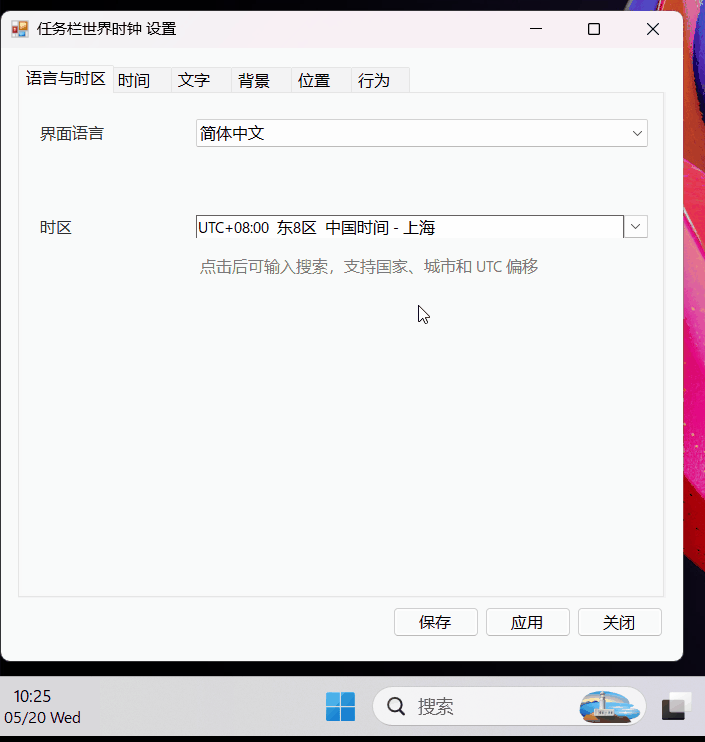
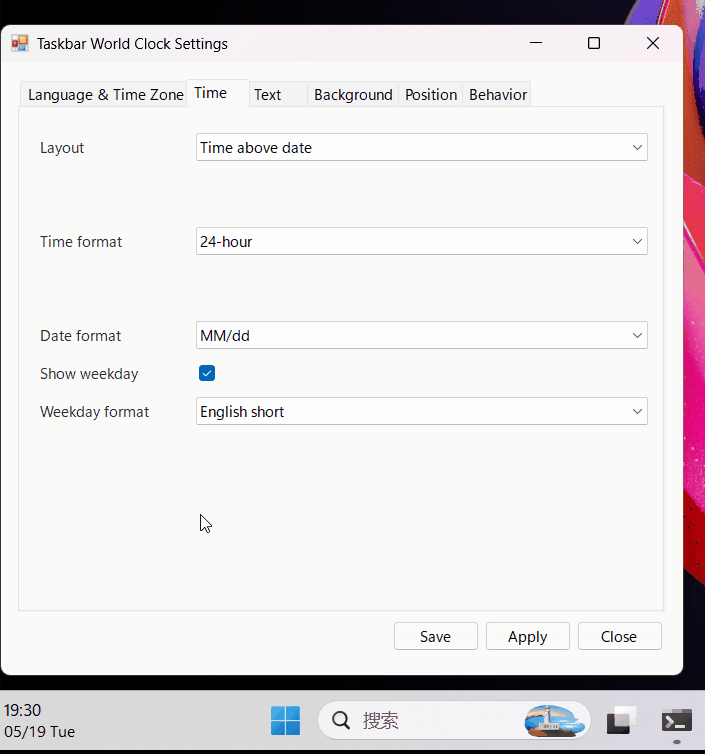
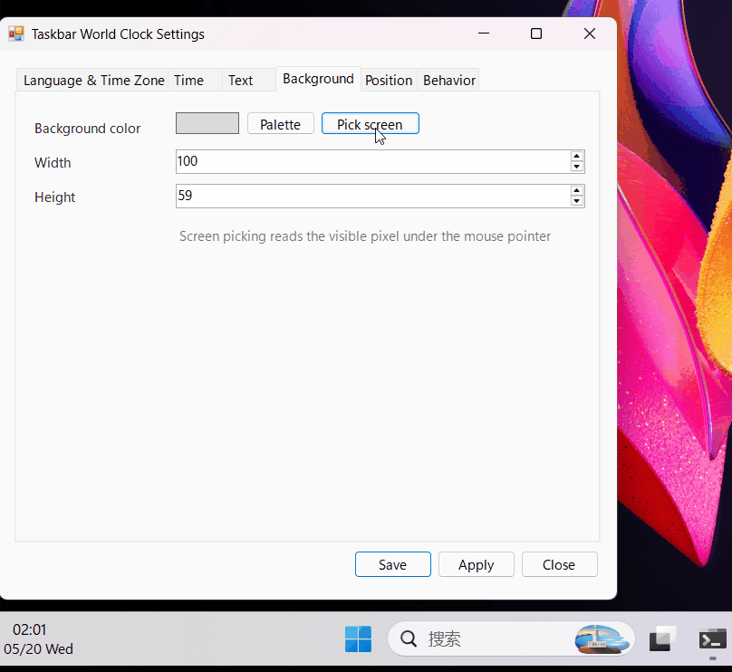
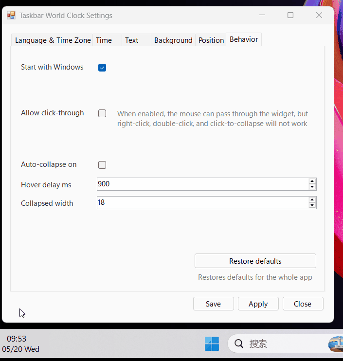
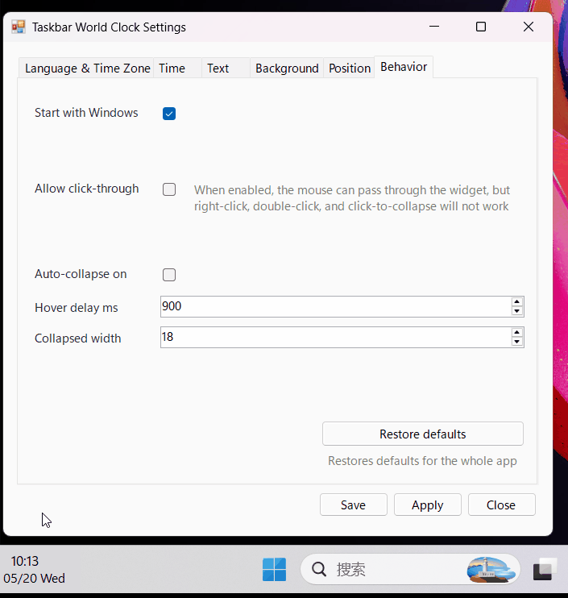
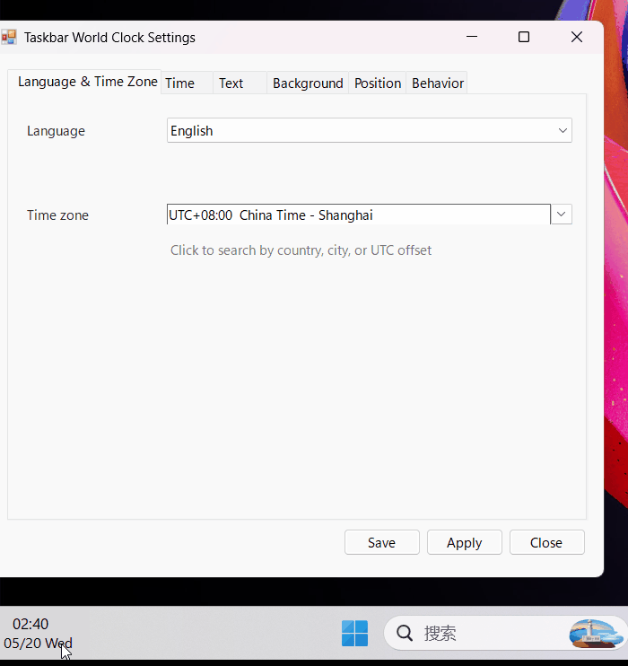

# Taskbar World Clock

[简体中文](README.zh-CN.md)

Taskbar World Clock is a lightweight Windows taskbar overlay that shows one extra time zone without changing your system clock.

Typical use cases include checking a teammate's working hours during cross-time-zone collaboration, or using tools such as Claude, where timezone and network-environment consistency matters.

The widget is meant to blend into the taskbar. You can place it away from the system clock, adjust its size and position, match the background color with the screen picker, choose your preferred time and date format, and collapse it quickly when you need the space.

## Features

- Search Windows time zones by city, country, localized name, or UTC offset.
- Customize time/date format, weekday display, font, colors, position, and size.
- Match the widget background to the taskbar with the screen color picker.
- Collapse on hover or use click-through mode when you do not want it blocking content.
- Optional start with Windows.

## Preview

<table>
  <tr>
    <td width="50%">
      <strong>Time Zone Search</strong><br>
      
    </td>
    <td width="50%">
      <strong>Time Format And Position</strong><br>
      
    </td>
  </tr>
  <tr>
    <td width="50%">
      <strong>Screen Color Picker</strong><br>
      
    </td>
    <td width="50%">
      <strong>Auto Collapse</strong><br>
      
    </td>
  </tr>
</table>

<details>
<summary>More previews</summary>

### Click Through



### Multi Language



</details>

## Download

Download the latest executable from [GitHub Releases](https://github.com/richie-liu512/taskbar-world-clock/releases).

The release file is:

```text
TaskbarWorldClock.exe
```

## Build

Run in PowerShell:

```powershell
.\build.ps1
```

The executable is generated at:

```text
dist\TaskbarWorldClock.exe
```

## Usage

Open the settings panel from the tray icon, right-click the widget, double-click the widget, or run:

```powershell
.\dist\TaskbarWorldClock.exe --settings
```

## Language Support

Taskbar World Clock includes built-in UI localization for Simplified Chinese, Traditional Chinese, Japanese, Korean, German, French, Spanish, Portuguese, and Russian.

## Settings And Local Data

Settings are stored locally at:

```text
%LOCALAPPDATA%\TaskbarWorldClock\settings.xml
```

The app does not require an account or a network connection for normal use.

## Roadmap

- Calendar view
- Stopwatch
- Timer
- More taskbar integration options

## Feedback

Suggestions and bug reports are welcome through GitHub Issues.

## License

MIT License. See [LICENSE](LICENSE).
